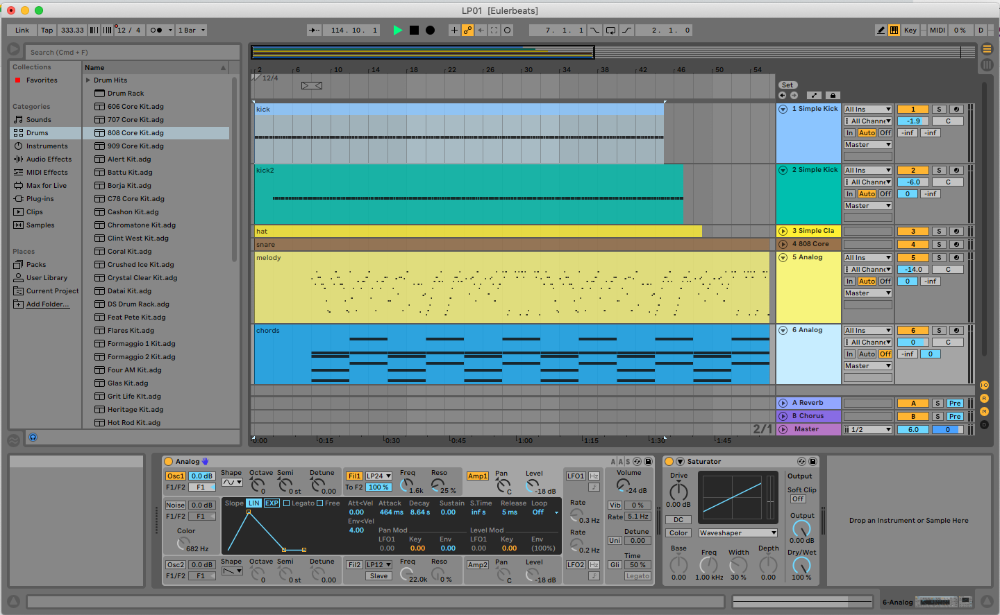

# WIP - Need to finish rest of Ableton files

These are MIDI/project file for remixing [Eulerbeats](https://eulerbeats.com/).
Everything is ripped from their on-chain(!!) audio generation code.

Big thanks to the Eulerbeats team for creating a great project. Ape strong

## How to run the generator
For me, just opening `index.html` does not work, I have to run

```
python -m http.server
```

or similar.

## How the on-chain code works

The Eulerbeats smart contract address is
`0x8754F54074400CE745a7CEddC928FB1b7E985eD6`.

To call the read functions on the contract is pretty easy on
[Etherscan](https://etherscan.io/address/0x8754F54074400CE745a7CEddC928FB1b7E985eD6#readContract).

`scriptCount()` shows that the script is chunked into 4 parts. So calling
`getScriptAtIndex(i)` for `i=0,1,2,3` gives us 4 tx hashes, which we can plug
into Etherscan. The code is contained in the input data of these 4 tx
(make sure to view in UTF-8).

The seeds I just found on OpenSea but there is probably a faster way such as filtering
for all of the `mintOriginal` events.

## How I converted to MIDI
Maybe it would have been easiest to just use Audio-To-MIDI in Ableton,
but I wanted to be precise. When you play a track with the generator script,
it console logs [Gibberish](https://github.com/gibber-cc/gibberish)
code which plays the audio. I didn't see an off-the-shelf solution to
convert Gibberish to MIDI, so I hacked together some JS to convert the note arrays
into MIDI.

The console log also shows the synth settings and how the reverb and chorus is hooked up.

`node export.js` will write all 27 MIDI files to the current directory.

## Recreating the Synths + Reverb

I have Ableton files ready made in the `Ableton/` folder. For other DAWs, synths can be set up
according to `synthinfo.txt` which I dumped from `synthinfo.js`. The numbers are scaled in weird multiples of 44100 though.
TODO: clarify this.

TODO: Create the `pwm` waveform (the horn-sounding one - think this can just be done in Operator). Improve the reverb if possible.

## .mp3
[LP01](https://media.eulerbeats.com/0506060502.mp3)
[LP02](https://media.eulerbeats.com/0434050703.mp3)
[LP03](https://media.eulerbeats.com/0302020302.mp3)
[LP04](https://media.eulerbeats.com/0511000303.mp3)
[LP05](https://media.eulerbeats.com/052a0a0603.mp3)
[LP06](https://media.eulerbeats.com/0214080703.mp3)
[LP07](https://media.eulerbeats.com/0535010503.mp3)
[LP08](https://media.eulerbeats.com/0424050803.mp3)
[LP09](https://media.eulerbeats.com/0021090900.mp3)
[LP10](https://media.eulerbeats.com/0411000900.mp3)
[LP11](https://media.eulerbeats.com/03380a0903.mp3)
[LP12](https://media.eulerbeats.com/0303060200.mp3)
[LP13](https://media.eulerbeats.com/0214070301.mp3)
[LP14](https://media.eulerbeats.com/0126080103.mp3)
[LP15](https://media.eulerbeats.com/0205010700.mp3)
[LP16](https://media.eulerbeats.com/0321080302.mp3)
[LP17](https://media.eulerbeats.com/031d030403.mp3)
[LP18](https://media.eulerbeats.com/0422050b03.mp3)
[LP19](https://media.eulerbeats.com/0507010200.mp3)
[LP20](https://media.eulerbeats.com/0125050203.mp3)
[LP21](https://media.eulerbeats.com/0106010503.mp3)
[LP22](https://media.eulerbeats.com/0328040403.mp3)
[LP23](https://media.eulerbeats.com/001c0a0903.mp3)
[LP24](https://media.eulerbeats.com/0425020b03.mp3)
[LP25](https://media.eulerbeats.com/0224000903.mp3)
[LP26](https://media.eulerbeats.com/0230080802.mp3)
[LP27](https://media.eulerbeats.com/0532070401.mp3)
